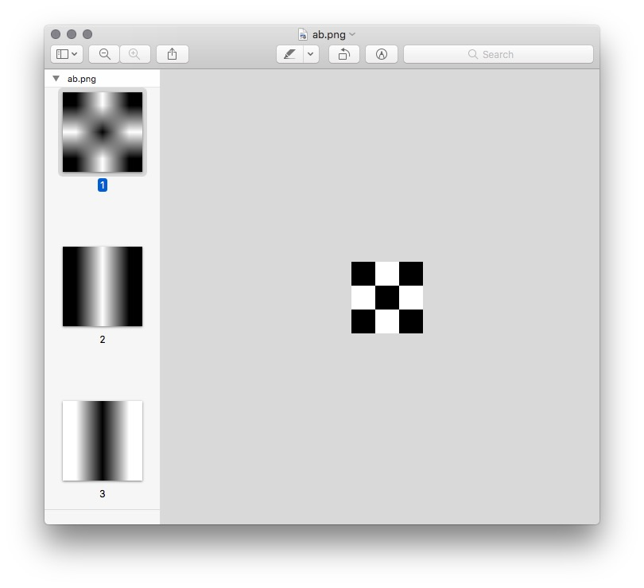

# Usage 

## Read
```
Gray[] gr = APNG.read(new File("my.apng"));
```

## Write

```
        byte x = (byte) 255;
        byte[] a0 = {
                0, x, 0,
                x, 0, x,
                0, x, 0 };
        byte[] a1 = {
                0, x, 0,
                0, x, 0,
                0, x, 0 };
        byte[] a2 = {
                x, 0, x,
                x, 0, x,
                x, 0, x };

        Gray[] g = new Gray[] {
                new Gray(3, 3, ByteBuffer.wrap(a0)),
                new Gray(3, 3, ByteBuffer.wrap(a1)),
                new Gray(3, 3, ByteBuffer.wrap(a2))};

        APNG.write(g, new File("my.apng"));

```



